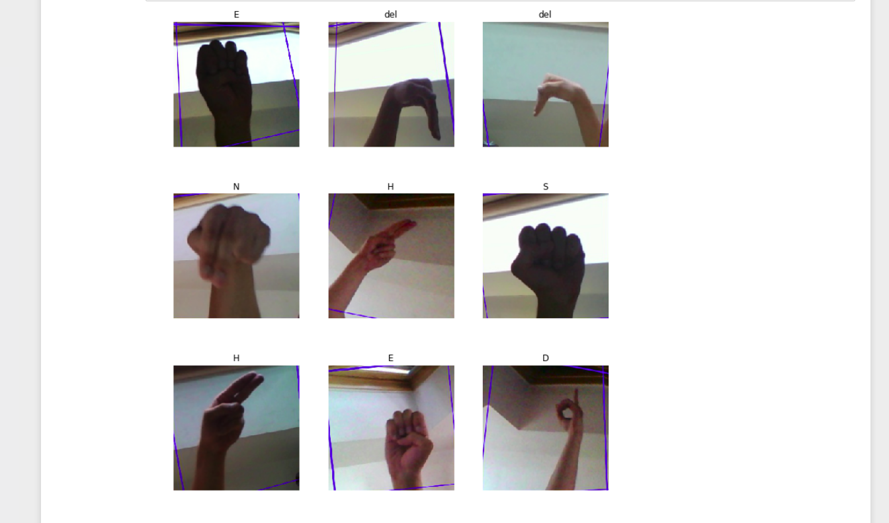

# ASL live predictor

This repository focuses on classification of [ASL  dataset](https://www.kaggle.com/grassknoted/asl-alphabet). This repository uses fastai library for building deep learning model for the purpose of classification. I have used resnet34 pretrained model which is trained on 87,000 images of size 200x200 pixels. There are 29 classes, of which 26 are for letters from A-Z, and the other three classes are for SPACE, DELETE and NOTHING. This model scores an aacuracy of **99.97%** without unfreezing of resnet34 model.

Below image shows different characters of sign language:

Visualization of some images of each letter:

## Tools and libraries used

* fastai
* opencv
* jupyter notebook

## Information on dataset
American Sign Language (ASL) is a natural language[6] that serves as the predominant sign language of Deaf communities in the United States and most of Anglophone Canada. Besides North America, dialects of ASL and ASL-based creoles are used in many countries around the world, including much of West Africa and parts of Southeast Asia. ASL is also widely learned as a second language, serving as a lingua franca. ASL is most closely related to French Sign Language (LSF). It has been proposed that ASL is a creole language of LSF, although ASL shows features atypical of creole languages, such as agglutinative morphology. More info on [wiki](https://en.wikipedia.org/wiki/American_Sign_Language)

